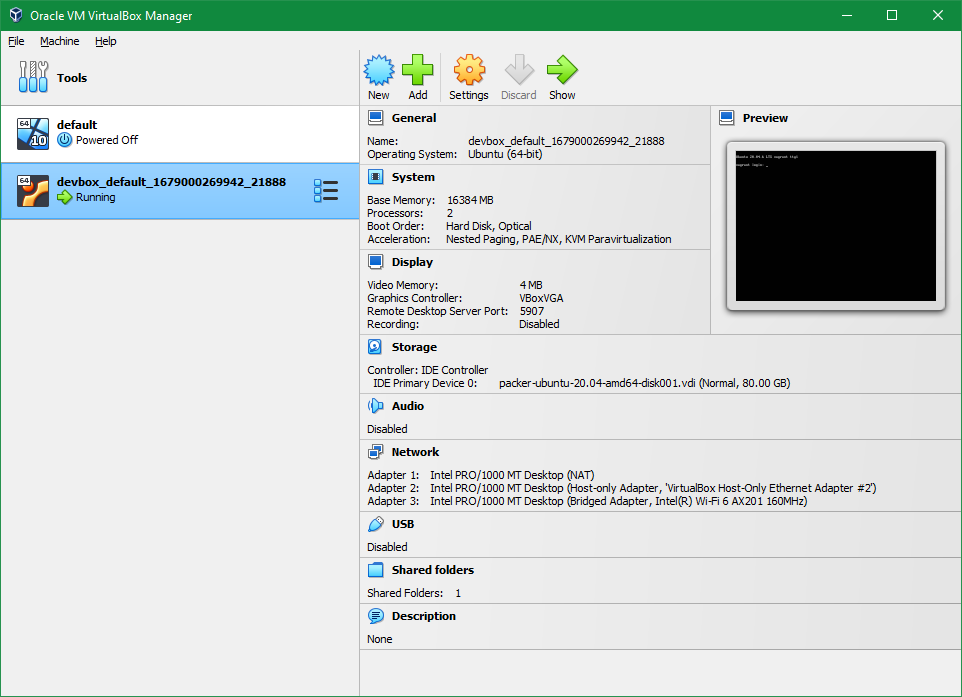
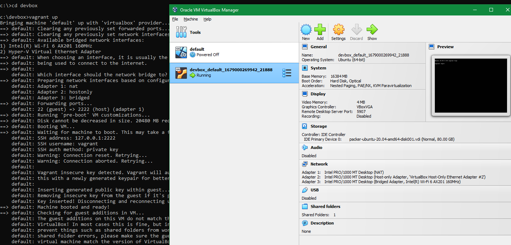

# MyVagrant

My Vagrant

## Common vagrant commands

Here are some common Vagrant commands that you can use:

```dos
vagrant init: Creates a new Vagrantfile in the current directory.

vagrant up: Creates and configures a new virtual machine according to your Vagrantfile.

vagrant ssh: Connects to the virtual machine via SSH.

vagrant halt: Stops the virtual machine.

vagrant destroy: Deletes the virtual machine.

vagrant reload: Reloads the virtual machine after changes have been made to the Vagrantfile.

vagrant status: Shows the status of the virtual machine.

vagrant suspend: Suspends the virtual machine.

vagrant resume: Resumes a suspended virtual machine.

vagrant box list: Lists all available boxes that can be used to create new virtual machines.

vagrant plugin list: Lists all installed Vagrant plugins.
```

These are some of the most common Vagrant commands that you will use frequently. You can find more detailed documentation on the Vagrant website.

## How to install Vagrant in Windows?

To install Vagrant on Windows, you can follow these steps:

Download and install VirtualBox: Vagrant requires a virtualization provider to work, and VirtualBox is the most popular provider. You can download the latest version of VirtualBox from the official website and install it on your Windows system.



Download and install Vagrant: Once you have installed VirtualBox, you can download the latest version of Vagrant from the official Vagrant website. Double-click on the downloaded file to start the installation process and follow the on-screen instructions to complete the installation.

Verify the installation: After the installation is complete, open a command prompt and type vagrant --version to verify that Vagrant has been installed correctly.

Choose a Vagrant box: You will need to choose a Vagrant box to use as the base image for your virtual machine. You can find a list of available boxes on the Vagrant website or create your own custom box.

Create a Vagrantfile: Once you have chosen a Vagrant box, you can create a Vagrantfile in your project directory to define the virtual machine's configuration. You can use a text editor to create a new file named Vagrantfile and configure it according to your needs.

Start the virtual machine: After you have created the Vagrantfile, you can start the virtual machine by running the command vagrant up in the project directory. Vagrant will download the base box if necessary and create the virtual machine according to the configuration in the Vagrantfile.

That's it! You have now installed and set up Vagrant on your Windows system.

## Troubleshooting

### 2023-03-17

Root cause:

Deleted the files in %HOME%\.VirtualBox

Solution:

- Remove insecure boxes in Virtual Box
- Uninstall Vagrant
- Reinstall Vagrant

(no need to create vm manually in Virtual Box)


